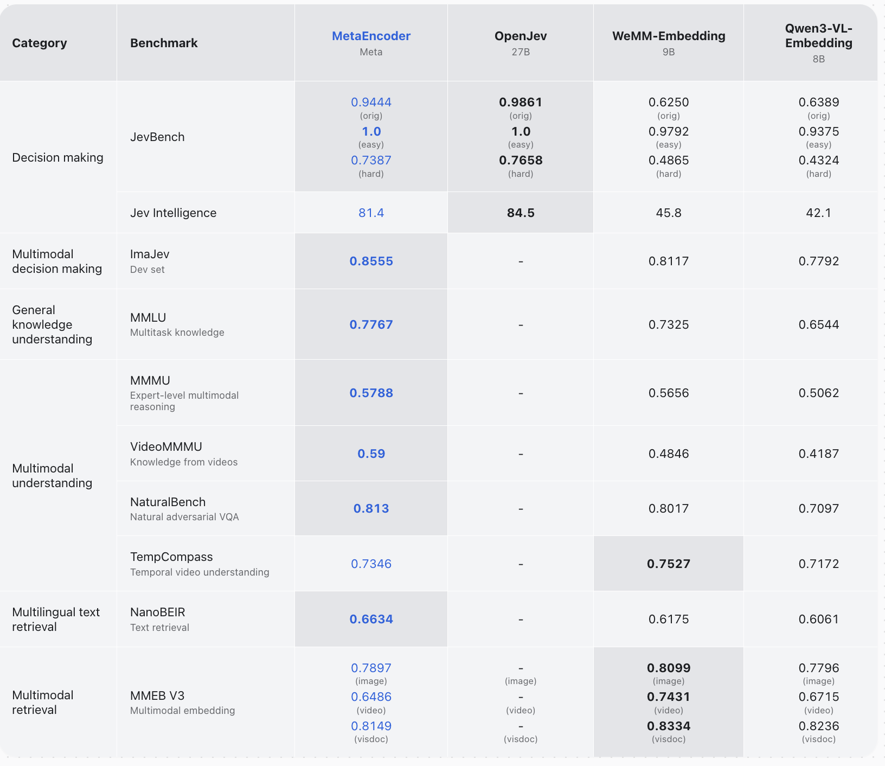

# MetaEncoder evaluation

Reproduces the results reported for [`facebook/meta-encoder`](https://huggingface.co/facebook/meta-encoder)
using only the public model and public data. Every embedding is computed with the
`MetaEncoder` class that ships with the model.



Video-MMMU and ImaJEV-Bench follow their official protocol. Video-MMMU per track
(Perception / Comprehension / Adaptation) is 0.7600 / 0.5767 / 0.4333 over 900 questions at
64 frames. ImaJEV-Bench calibration is 0.9012; its test split is scored by the maintainers.

MetaEncoder scores were measured on 8 x 80 GB GPUs with the pinned `requirements.txt`. Suite scores are
unweighted means over tasks. Per-task reference numbers are in
[`reference_scores.json`](reference_scores.json).

## Setup

```bash
pip install -r requirements.txt
huggingface-cli download facebook/meta-encoder --local-dir /path/to/meta-encoder
```

Keep `torchvision<0.27`: newer releases switch the image processor from BICUBIC to LANCZOS
resampling, which changes image embeddings.

The model is 30B parameters. Evaluation runs one full bf16 copy per GPU (about 62 GB), so it needs
GPUs with 80 GB of memory; 8 GPUs is the intended setup.

## Data

```bash
python scripts/download_data.py   --data-root /path/to/data
python scripts/prepare_closed_set.py --data-root /path/to/data
```

`download_data.py` fetches MMEB-V2 images/frames (TIGER-Lab/MMEB-V2, several hundred GB), MCMR
(VLM2Vec/MMEB-V3), the Video-MMMU videos, NanoBEIR, JEVBench, and ImajevBench with its harness.
`prepare_closed_set.py` builds the MMLU and MMMU manifests. The MMEB query and candidate
files are downloaded from the Hub during evaluation. Dataset revisions are pinned in the scripts.

## Run

```bash
torchrun --nproc_per_node=8 run_eval.py \
    --model /path/to/meta-encoder --data-root /path/to/data --out results/

python -m metaencoder_eval.jevbench \
    --model /path/to/meta-encoder --data-dir /path/to/data/jevbench --out results/jevbench

python -m metaencoder_eval.imajev --model /path/to/meta-encoder \
    --dataset /path/to/data/imajev-bench --harness /path/to/data/imajev-harness/src --out results/imajev

python compare.py results/ --per-task
```

`--suites` picks a subset (`mmeb_image,mmeb_video,mmeb_visdoc,videommmu,nanobeir,mmlu,mmmu`);
`--tasks` restricts to named tasks. Finished tasks are skipped on rerun. Each task writes
`<task>_score.json` and `<task>_pred.jsonl`; each suite writes `summary.json`.
[`scripts/eval_all.sbatch`](scripts/eval_all.sbatch) is a SLURM example.

`compare.py` passes a suite within 0.5 points of the reference, and a JEVBench split within two
questions. Batched bf16 inference is not bit-exact across batch compositions, so individual
small tasks can move by a question or two.

## Protocol

Every task ranks candidates by cosine similarity between a task embedding and candidate
embeddings. Closed-set tasks rank each question's own options; open-set tasks rank the full
corpus.

- **JEVBench.** The task prompt is the row's state, instruction, label criteria and option list:

  ```text
  {state}

  Task: {instruction}
  Criteria:
  - {label}: {meaning}
  Options: {label}, {label}, ...
  ```

  Candidates are the bare labels.
- **MMLU, MMMU.** The task is `Select the correct option. {question}` with the options listed
  in the prompt (`Options:\nA. ...`). Candidates are the option texts. MMLU uses the 14,042
  test questions. MMMU uses the validation and test splits of `MMMU/MMMU` at the pinned revision
  (which includes test answers), minus open-ended questions and questions whose options differ
  only by which image they reference.
- **ImaJEV.** Run and scored with the benchmark's own harness
  ([mohit67890/imajev](https://github.com/mohit67890/imajev) at a pinned commit), under its
  rules: every item is scored, Unknown is correct only when the reference is Unknown, and a
  system abstains by choosing Unknown. The task prompt is the question and state followed by the
  allowed answers as a lettered list (`A. yes: ...`) ending with the harness's neutral Unknown
  option; the candidates are the bare labels (`yes`, `no`, option values, `unknown`), and the
  answer is the highest-cosine candidate. This encoding was chosen on the dev and calibration
  splits over the alternatives (no option list; label-plus-description or description-only
  candidates): it gains 8 of 254 items, all from abstaining on Unknown items.
  Probabilities (for ECE and Brier) are a softmax over the cosines, with one temperature fitted
  on the calibration split. `python -m metaencoder_eval.imajev` writes a harness run folder for
  every split and for the `full`, `no_image` and `no_state` conditions the benchmark requires.
  Dev and calibration are scored locally. The test split's labels are withheld: the leaderboard
  number comes from submitting `test-full` (with the two control runs) to the maintainers, as
  described in the benchmark's README. MetaEncoder belongs with the single-pass decision models
  (leaderboard section A2): a single pass with the options listed once, in record order.
- **Video-MMMU.** The official accuracy over all 900 questions, reported per track (Perception,
  Comprehension, Adaptation; 300 each), with Overall as their mean. 64 frames per clip, all of the
  frames extracted per clip. The frame count was set after a sweep on the test set itself
  (Video-MMMU has no development split): 8 / 16 / 32 / 64 frames give 0.532 / 0.553 / 0.580 /
  0.590 overall. Prompt wording was swept too and left at its default, which scored best.
  Adaptation questions get the clip and the question's image. The 21 open-ended Adaptation
  questions, which an option-ranking encoder cannot answer, count as wrong.
- **NanoBEIR.** Seven subsets with a counterpart in training (MSMARCO, HotpotQA, FEVER, NFCorpus,
  FiQA2018, NQ, Quora) use the e5-mistral query instruction for that task; the other six use no
  instruction.
- **MMEB-V3.** MMEB-V3 gathers the MMEB-V2 image, video and visual-document tasks plus MCMR, with the
  instructions and candidate sets in `metaencoder_eval/tasks/`.

## Layout

```text
run_eval.py                    distributed evaluation over suites
compare.py                     check results against reference_scores.json
metaencoder_eval/encoder.py    turns task rows into MetaEncoder inputs; sharded encoding
metaencoder_eval/tasks/        dataset parsers (adapted from VLM2Vec)
metaencoder_eval/suites/       task lists per suite
metaencoder_eval/jevbench.py   JEVBench
scripts/                       data download and manifest builders
```

## License

Apache 2.0
